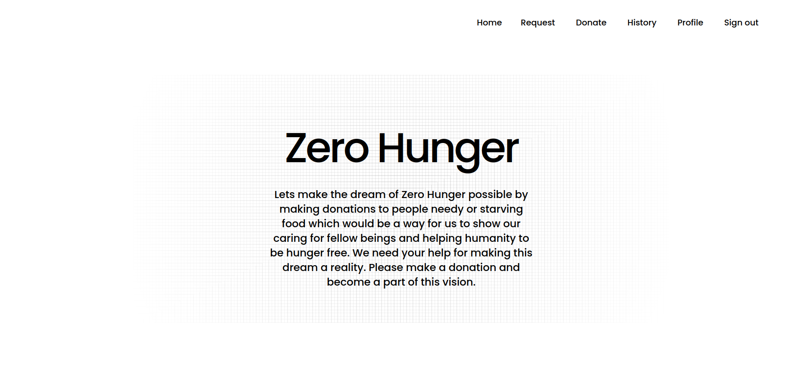

## CommunityEats
Welcome to CommunityEats, where every meal shared is a step towards a hunger-free world and every waste reused is a stride towards a cleaner, greener planet. Our mission is simple: to make society and the world a better place to live in by connecting those in need with those who have resources to spare.

At the heart of CommunityEats are two main user roles: Requestors and Donators. Requestors can raise requests for food or specific types of waste, while Donators can fulfill these requests by providing either food items or recyclable materials.

Whether it's a meal for a hungry individual or waste materials waiting to be repurposed, CommunityEats facilitates the exchange seamlessly. Requestors can specify their needs, from food items to recyclable waste, and Donators can contribute by providing either the requested items or monetary support.


## Team members

- Aswin K O
- Sreyas Satheesh
- Jerry James
- Manu Jose

## Link to product walkthrough

[link to ppt](./docs/Waste%20Control%20and%20food%20donation%20application.pptx)
-communityEats

## How it works

CommunityEats is a comprehensive web application designed to combat hunger and promote waste reuse, ultimately contributing to a better society and environment. Let's delve into how the platform operates:

1. User Roles:
Requestors: These users initiate requests for food or specific types of waste, whether on behalf of themselves or their organizations.
Donators: Donators contribute to fulfilling these requests by donating food items, money, or recyclable waste materials.
2. Request Creation:
Requestors can create requests for either food or waste items, specifying the type and quantity needed. Requests can be made for usable food waste (e.g., suitable for cattle feed) or recyclable waste materials (e.g., paper, polythene bags).
3. Donation Process:
Donators browse through active requests and choose which ones they want to fulfill. They can donate either food items, monetary contributions (for food requests), or suitable waste materials.
4. Expiry Time Setting:
When a user wishes to donate surplus food, they set an expiry time for the donation. This determines the duration within which the donation must be collected to prevent food waste.
5. Notification System:
Upon accepting a donation request, the recipient receives notifications containing relevant details such as pickup location and time. These notifications ensure timely collection of donations.
6. Mercy Time Handling:
If a recipient is unable to collect the donation within the specified time frame, a grace period, or "mercy time," is provided. This allows for flexibility in case of unforeseen circumstances.
7. Food Waste Management:
If no recipient collects the donation before the expiry time or mercy time elapses, the surplus food is marked as food waste. Other users in need of food waste can then accept the request and arrange for its collection.
8. Intermediary Role:
CommunityEats serves as an intermediary between those in need and those with resources, facilitating efficient donation processes and waste management. It brings together individuals and organizations to address essential needs in the community.
9. Technological Infrastructure:
The frontend and backend of CommunityEats are developed using Next.js, providing a seamless user experience and efficient server-side rendering. MongoDB serves as the database for storing user data and donation requests, while Prisma functions as the ORM for data access and manipulation.

In summary, CommunityEats functions as a collaborative platform where users can connect to address essential needs, promote waste reuse, and contribute to building a better world. Through its efficient donation processes and waste management strategies, it aims to achieve zero hunger and foster environmental sustainability.

## Snapshots

- Home



## Libraries used
- Next.js
- Bun.js
- Clerk
- Prisma
- MongoDb

## How to configure

This is a [Next.js](https://nextjs.org/) project bootstrapped with [`create-next-app`](https://github.com/vercel/next.js/tree/canary/packages/create-next-app).

1. Clone the Repo
```bash
git clone https://github.com/ImSreyas/akatsuki.git
```

2. Change directory
```bash
cd akatsuki
```

3. Install Node.js or Bun.js if not installed.
   
   Visit Node.js - [Install](https://nodejs.org/en/download)

   Visit Bun.js - [Install](https://bun.sh/)

  
5. Install node modules (use any one of them)
```bash
bun install
```
```bash
npm install
```
```bash
pnpm install
```
```bash
yarn install
```

## How to run

First, run the development server:

```bash
npm run dev
# or
yarn dev
# or
pnpm dev
# or
bun dev
```

Open [http://localhost:3000](http://localhost:3000) with your browser to see the result.

You can start editing the page by modifying `app/page.tsx`. The page auto-updates as you edit the file.

## Learn More

To learn more about Next.js, take a look at the following resources:

- [Next.js Documentation](https://nextjs.org/docs) - learn about Next.js features and API.
- [Learn Next.js](https://nextjs.org/learn) - an interactive Next.js tutorial.

You can check out [the Next.js GitHub repository](https://github.com/vercel/next.js/) - your feedback and contributions are welcome!